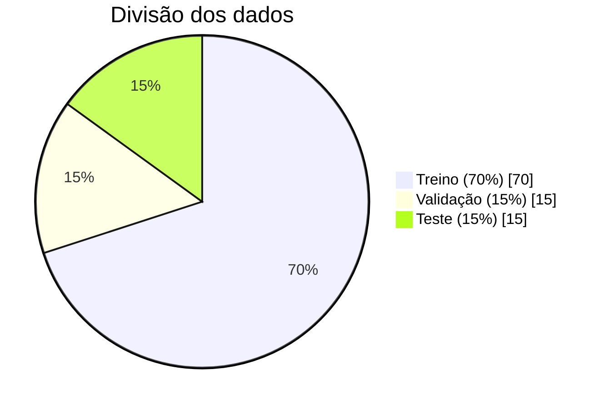
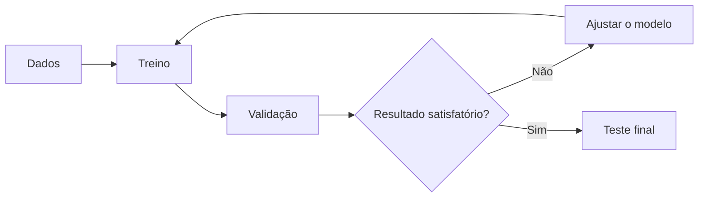

# Exemplos de gráficos em Markdown

Esta nota serve para testar a visualização de gráficos e diagramas no Obsidian. Abra-a no modo de leitura ou na visualização ao vivo para ver os blocos Mermaid renderizados.

## Exemplo 1 — divisão dos dados

Os valores abaixo são apenas ilustrativos.

## Exemplo 2 — fluxo de desenvolvimento

## Exemplo 3 — tabela de resultados

Tabelas também funcionam diretamente em Markdown:

| Etapa     | Exemplos | Acurácia ilustrativa |
| --------- | -------: | -------------------: |
| Treino    |      700 |                  92% |
| Validação |      150 |                  87% |
| Teste     |      150 |                  85% |

**Acurácia** é a proporção de previsões corretas. Os números desta tabela são fictícios.
